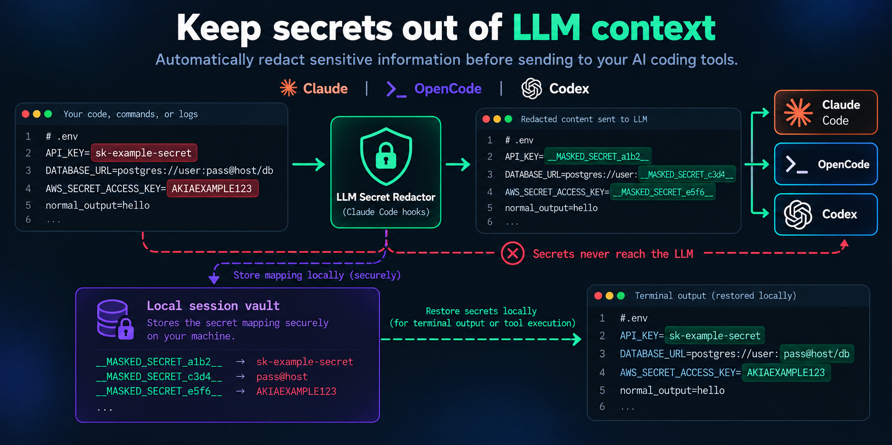

# llm-secret-redactor

Memory-only secret redactor for **Claude Code** and **OpenCode**.

Prevents sensitive credentials (API keys, passwords, database URIs, bearer tokens, JWTs) from reaching LLMs when read from files, logs, or command output. Mappings live only in a per-user memory broker and are restored only for local tool execution or an explicit local reveal.

<p align="center">
  
</p>

## Supported Clients

- **Claude Code**: Uses native lifecycle hooks (`SessionStart`, `SessionEnd`, `UserPromptSubmit`, `PostToolUse`, `PreToolUse`, `MessageDisplay`).
- **OpenCode**: Uses server hooks for redaction and tool restoration, plus a local TUI command for confirmed reveal.

---

## How It Works

### OpenCode Integration

In OpenCode, user messages and tool output are masked before they are persisted or rendered. Model context is masked again at dispatch as defense in depth.

```text
User / files / tools
        |
        v
OpenCode hooks
        |
        | mask regex matches -> __MASKED_<kind>_<random>__
        v
       LLM
        |
        | masked tokens in response / tool calls
        +-----------------------+
        |                       |
        v                       v
confirmed local reveal   tool argument restoration
(temporary TUI dialog)   (tool.execute.before)
        |                       |
        v                       v
Terminal / User          Local tool execution
(10 seconds)             (original plain values)
```

1. **Secure-by-default UI**: Canonical user messages and tool results remain redacted. There is no automatic assistant-response unmasking.
2. **Memory broker**: One automatically started broker per OS user holds mappings in RAM. Clients communicate over a mode-`0600` Unix socket inside a mode-`0700` runtime directory. No plaintext vault file is written.
3. **Tool Argument Restoration**: When the model issues a tool call containing masked values (e.g. `read("/home/__MASKED_USER_...__/config.json")`), arguments are recursively unmasked before local execution, if the [restore policy](#restore-policy) allows that tool. OpenCode cannot prompt from a server hook, so tools set to `ask` (Bash by default) are refused there.
4. **Unknown tokens are refused**: A tool call that references tokens the session cannot resolve (expired, broker restarted, or from another session) fails instead of writing literal mask tokens to disk.
5. **Confirmed reveal**: Press the reveal shortcut, approve the confirmation, and OpenCode shows mappings in a local dialog for 10 seconds. Press it again to hide immediately.
6. **Selection scope**: If terminal text is selected, only mask tokens inside that selection are revealed. A selection containing no tokens never falls back to revealing the whole session.
7. **Session isolation**: Random 128-bit tokens and separate per-session maps prevent cross-session restoration. Sessions expire after inactivity and are cleared when OpenCode deletes the session.

### Claude Code Integration

1. **Prompt Guard (`UserPromptSubmit`)**: Blocks prompt submission if raw secrets are typed directly. Claude Code hooks cannot rewrite a prompt, so unlike OpenCode the prompt is blocked rather than masked.
2. **Data Redaction (`PostToolUse`)**: Replaces secrets in tool outputs (files, commands, logs) with random opaque tokens before sending to Claude. If the broker is unavailable, secrets are replaced with irreversible `[REDACTED_<kind>]` markers instead of passing through.
3. **Memory broker**: `SessionStart` starts or reuses the per-user broker; `SessionEnd` clears that session. No plaintext vault is written.
4. **Terminal Unmasking (`MessageDisplay`)**: Restores original secrets in streamed responses so you read plain text.
5. **Tool Unmasking (`PreToolUse`)**: Unmasks tokens before subsequent tool executions, following the [restore policy](#restore-policy): file tools run directly, web tools are denied, and anything else (such as Bash) asks you first. Tokens the session cannot resolve are denied.

---

## Configuration

Both Claude Code and OpenCode consume the same shared pattern configuration in `patterns.json`:

```json
[
  {
    "name": "OpenAI key",
    "pattern": "sk-[a-zA-Z0-9_\\-]{20,}",
    "kind": "TOKEN"
  },
  {
    "name": "GitHub Token",
    "pattern": "gh[pousr]_[a-zA-Z0-9]{36,}",
    "kind": "TOKEN"
  },
  {
    "name": "Generic bearer token",
    "pattern": "bearer\\s+([a-zA-Z0-9_\\-.]{20,})",
    "flags": "i",
    "kind": "BEARER_TOKEN"
  }
]
```

To add custom patterns, modify or extend `patterns.json`. The shared broker loads this configuration for both clients. A pattern without groups masks the whole match. With one group, only that group is masked; with two or more, group 2 is masked and the groups around it are kept as context.

### Restore policy

`policy.json` decides which tools may run with real values restored in place of mask tokens:

```json
{
  "default": "ask",
  "tools": {
    "Read": "allow",
    "Write": "allow",
    "WebFetch": "deny",
    "bash": "allow"
  }
}
```

- `allow`: restore silently.
- `ask`: Claude Code asks you before the tool runs. OpenCode refuses, because its server hooks cannot prompt.
- `deny`: refuse the tool call.

Tool names are matched exactly, so list Claude Code names (`Bash`) and OpenCode names (`bash`) separately. Set `SECRET_REDACTOR_POLICY` to point the broker at a policy file outside the install directory, so reinstalling does not overwrite it.

---

## Installation

Run interactive installer via curl:

```bash
curl -fsSL https://raw.githubusercontent.com/mhbahmani/llm-secret-redactor/master/install.sh | bash
```

To install a specific tag or commit instead of `master`, set `SECRET_REDACTOR_REF` (or pass `--ref` to `install.py`):

```bash
curl -fsSL https://raw.githubusercontent.com/mhbahmani/llm-secret-redactor/<ref>/install.sh | SECRET_REDACTOR_REF=<ref> bash
```

The installer is **fully idempotent** and interactively guides you through:
1. **Action**: `Install` or `Uninstall`.
2. **Target client**: `Both`, `Claude Code`, or `OpenCode`.
3. **Scope**:
   - **Local**: Project-level (`.claude/` or `.opencode/`) — applies only to the current repository.
   - **Global**: User-level (`~/.claude/` or `~/.config/opencode/`) — applies across all sessions on your machine.
4. **Destination path**: Accept default or specify custom path.

### Command-line Flags

Bypass interactive prompts using flags:

```bash
# Install for both clients globally
./install.sh --install --all --global

# Install only for OpenCode locally
./install.sh --install --opencode --local

# Choose the OpenCode reveal shortcut during non-interactive installation
./install.sh --install --opencode --local --reveal-keybind=ctrl+shift+r

# Install only for Claude Code globally
./install.sh --install --claude --global

# Uninstall OpenCode integration
./install.sh --uninstall --opencode --global
```

The installer writes the shortcut under `keybinds.secret-redactor.ui.toggle` in the selected OpenCode `tui.json`. Change that value later to customize it. The default is `ctrl+shift+r`.

---

## Uninstallation

To cleanly remove redactor integrations without affecting other settings or hooks:

```bash
# Interactive uninstallation
./install.sh --uninstall

# Or target a specific client
./install.sh --uninstall --opencode
./install.sh --uninstall --claude
```

What uninstallation does:
- Removes the isolated redactor directories (`hooks/secret-redactor/` or `plugins/secret-redactor/`).
- Creates a timestamped backup of configuration it changes (`settings.json`, `opencode.json` / `opencode.jsonc`, or `tui.json`).
- Removes only redactor hook/plugin registrations while leaving custom tools, settings, and other plugins completely intact.

---

## Testing

Run all automated tests across Python and JavaScript:

```bash
# Run both JavaScript and Python test suites
npm run test:all

# Run JavaScript OpenCode unit and integration tests
npm test

# Run Python Claude Code tests
npm run test:python
```

For manual testing, install into `test-project/` (ignored by git) and start the client from there, so the redactor does not run on this repository itself.

---

## Architecture & Limitations

- **OpenCode transcript limitation**: The public TUI API does not let plugins rewrite the built-in transcript in place. Confirmed plaintext therefore appears in a temporary local dialog; the stored transcript stays redacted.
- **Platform support**: The broker requires Unix-domain sockets (Linux, macOS, or WSL). Native Windows is not currently supported.
- **Threat model**: This removes plaintext-at-rest aggregation and restricts the socket to the current OS user. It does not protect against malware or an attacker already running code as that same user, who may inspect process memory or interact with the local socket.
[- **Claude display behavior**: Claude Code currently restores masked values through its local `MessageDisplay` hook. The confirmed, timed reveal command described above is OpenCode-specific.
